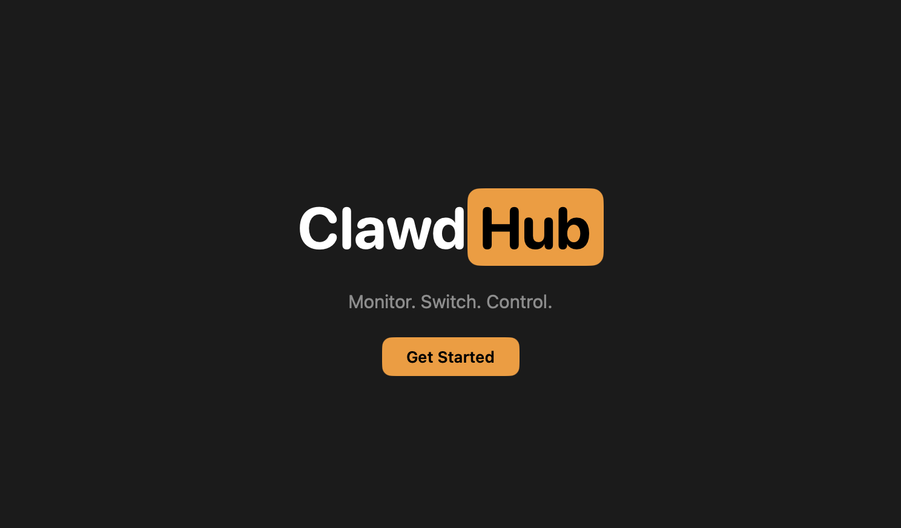
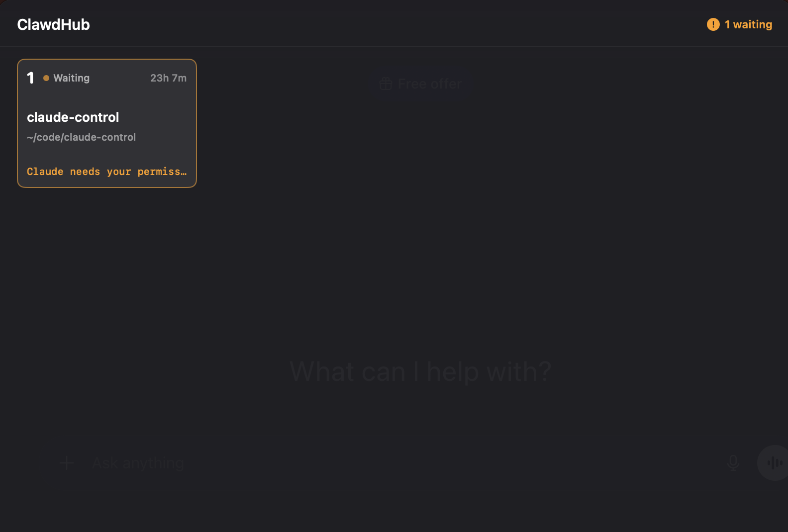

<p align="center">
  
</p>

<p align="center">
  <b>The command center for your Claude Code agents.</b><br>
  A native macOS menubar app that lets you monitor, switch between, and control all your Claude Code sessions with a single keyboard gesture.
</p>

<p align="center">
  <a href="#installation">Installation</a> &nbsp;&bull;&nbsp;
  <a href="#how-it-works">How It Works</a> &nbsp;&bull;&nbsp;
  <a href="#features">Features</a> &nbsp;&bull;&nbsp;
  <a href="#supported-terminals">Terminals</a> &nbsp;&bull;&nbsp;
  <a href="#building-from-source">Build</a>
</p>

---

## The Problem

You're running 3 Claude Code agents across different terminals. One finishes and needs a review. Another is stuck waiting for permission. The third is still churning. You're Alt-Tabbing between terminal windows, losing track of which agent is where.

## The Solution

ClawdHub gives you **Cmd+Tab for Claude Code**. Hold `Option+Command` to see all your agents at a glance. Tap `Command` to pick one. Release `Option` to jump straight to its terminal. The whole interaction takes under a second.

<p align="center">
  
</p>

## Installation

### Download

> Coming soon — pre-built `.app` releases will be available here.

### Build from Source

Requires macOS 13.0+ and Xcode 15+.

```bash
git clone https://github.com/ManmeetSethi/clawdhub.git
cd clawdhub
bash scripts/build.sh
```

The built app will be at `build/DerivedData/Build/Products/Release/ClawdHub.app`. Drag it to your Applications folder.

Or open `ClawdHub/ClawdHub.xcodeproj` in Xcode and hit Cmd+R.

### First Launch

ClawdHub walks you through a guided onboarding:

1. **Accessibility** — Grant permission so ClawdHub can detect the global hotkey
2. **Notifications** — Allow alerts when agents need your attention
3. **Hooks** — ClawdHub installs [Claude Code hooks](https://docs.anthropic.com/en/docs/claude-code/hooks) to track session state
4. **Tutorial** — Practice the peek/cycle/open gesture hands-on

After setup, start any new Claude Code session and it will appear in ClawdHub automatically.

## How It Works

### The Gesture

| Action | What Happens |
|--------|-------------|
| Hold **Option + Command** | Panel appears — see all your agents at a glance |
| Tap **Command** (keep holding Option) | Cycle through agents one by one |
| Release **Option** | Jump to the selected agent's terminal window |

That's it. Three moves, under a second.

### Persistent Mode

Hold Option+Command for more than a second, then release both. The panel stays open so you can browse. Press **1–9** to jump to an agent by number, or **Escape** to dismiss.

### Behind the Scenes

ClawdHub installs lightweight shell hooks into Claude Code's [hook system](https://docs.anthropic.com/en/docs/claude-code/hooks). These hooks write session state to `~/.clawdhub/sessions.json` whenever an agent starts working, finishes, or needs input. ClawdHub watches this file and keeps the dashboard in sync.

| Event | What Gets Tracked |
|-------|-------------------|
| You send a message | Session created/updated as **Running** |
| Claude uses a tool | Current tool + file/command captured |
| Claude needs permission | Status flips to **Waiting** + notification sent |
| Claude finishes | Status set to **Done** |
| Session ends | Removed from dashboard |

## Features

- **Real-time status** — Running, Waiting, Done — with live activity details (current tool, file being edited, command being run)
- **Smart notifications** — Get alerted only when an agent needs your attention (permission prompts, input requests)
- **Menubar indicator** — Color-coded dot shows fleet status at a glance: green (all clear), yellow (working), orange pulsing (needs attention)
- **Multi-terminal support** — Automatically detects and switches to the right terminal window
- **Zero config** — No API keys, no server, no accounts. Everything runs locally.

## Supported Terminals

| Terminal | Focus Method |
|----------|-------------|
| Terminal.app | AppleScript |
| iTerm2 | AppleScript |
| VS Code | AppleScript + bundle ID |
| Cursor | CLI (`cursor -r`) |
| Ghostty | AppleScript + bundle ID |
| WezTerm | AppleScript + bundle ID |
| Alacritty | AppleScript |
| Kitty | AppleScript |
| Warp | AppleScript |

## Requirements

- macOS 13.0 (Ventura) or later
- [Claude Code](https://docs.anthropic.com/en/docs/claude-code) CLI installed
- Accessibility permission (for global hotkey)

## Building from Source

```bash
# Clone
git clone https://github.com/ManmeetSethi/clawdhub.git
cd clawdhub

# Build via command line
bash scripts/build.sh

# Or open in Xcode
open ClawdHub/ClawdHub.xcodeproj
```

### Project Structure

```
ClawdHub/
├── AppDelegate.swift              # Lifecycle + wiring
├── Models/                        # Session, status, settings
├── Managers/
│   ├── SessionManager.swift       # File watcher + state
│   ├── HotkeyManager.swift        # Global hotkey detection
│   ├── HookRegistrar.swift        # Hook script deployment
│   ├── TerminalFocusManager.swift # Terminal window switching
│   └── NotificationManager.swift  # macOS notifications
├── Controllers/
│   ├── PanelController.swift      # Floating panel (NSPanel)
│   └── OnboardingController.swift # Guided setup wizard
├── Views/                         # SwiftUI views
└── Hooks/                         # Source hook scripts
```

## Important Notes

- **Only new sessions are tracked.** Claude Code reads hooks at startup — restart any running sessions after installing ClawdHub to pick them up.
- **Hooks are redeployed on launch.** ClawdHub refreshes its hooks every time it starts, so updates are automatic.
- **Ad-hoc builds may need TCC reset.** If accessibility stops working after a rebuild, run:
  ```bash
  tccutil reset Accessibility com.clawdhub.app
  ```

## License

All rights reserved.
